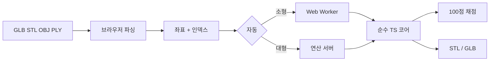

<p align="center">
  
</p>

<h1 align="center">MeshCap</h1>

<p align="center">
  <b>생성형 3D는 예쁘게 나옵니다. 출력이 안 될 뿐입니다.</b><br />
  Meshy · Tripo 메시의 구멍을 찾아 메우고, 슬라이서에 넣어도 되는지 100점으로 채점합니다.
</p>

<p align="center">
  <a href="https://meshcap.junnnny.kr"></a>
</p>

<p align="center">
  <a href="https://github.com/JunnnnyWon/meshcap/actions/workflows/ci.yml"></a>
  <a href="LICENSE"></a>
  
  
  
</p>

<p align="center">
  <a href="https://meshcap.junnnny.kr"><b>데모</b></a> ·
  <a href="#빠른-시작">빠른 시작</a> ·
  <a href="#파이프라인">파이프라인</a> ·
  <a href="#실제-모델">실제 모델</a> ·
  <a href="#알려진-한계">한계</a>
</p>

<p align="center">
  
</p>

<br />

## 한 줄로

브라우저에 GLB · STL · OBJ · PLY를 놓으면, 구멍을 분류해 메우고, 밀폐·다양체·법선을 검사한 뒤 **출력 적합성 점수**와 함께 STL/GLB를 내려줍니다.

원본 파일은 어떤 경우에도 서버로 올라가지 않습니다. 기본은 브라우저 처리입니다. 큰 모델만 좌표와 인덱스를 연산 서버로 넘길 수 있습니다.

<p align="center">
  
</p>

<p align="center"><sub>예제 「물결 개구부 튜브」 — 비평면 테두리를 Liepa 삼각화와 바닥 받침으로 닫습니다. 65점 → 100점.</sub></p>

## 무엇을 고치나

Meshy나 Tripo로 캐릭터를 뽑으면 화면에서는 멀쩡해 보입니다. 슬라이서에 넣는 순간 막힙니다. 겨드랑이와 머리카락 사이에 구멍이 남아 있고, 바닥은 뚫려 있으며, 면의 앞뒤가 뒤섞여 있기 때문입니다. 슬라이서는 법선으로 안팎을 판정하므로 열린 메시의 내부를 채우지 못합니다.

MeshCap은 파일을 넣으면 다음을 수행합니다.

- 좌표가 같은데 인덱스만 다른 정점을 병합해 **구멍 오탐을 제거**
- 짝 없는 half-edge를 모아 **비다양체 지점에서도 끊기지 않는 테두리를 복원**
- 면의 감는 방향을 통일해 **뒤집힌 면이 구멍으로 오인되는 것을 방지**
- 구멍마다 크기·평면성·방향을 재서 **서로 다른 방식으로 메움**
- 밀폐 여부, 다양체 위상, 법선, 관통을 검사해 **100점으로 채점**
- 보정된 메시를 **STL 또는 GLB로 내보냄**

<table>
  <tr>
    <td align="center" width="50%">
      
      <br /><sub>보정 전 · 구멍 테두리</sub>
    </td>
    <td align="center" width="50%">
      
      <br /><sub>보정 후 · 새로 만든 면 · 25 → 100</sub>
    </td>
  </tr>
</table>

## 실제 모델

합성 예제만이 아닙니다. 서비스에서 받은 캐릭터 STL로 브라우저에서 돌렸습니다.

<table>
  <tr>
    <th></th>
    <th align="left">Meshy</th>
    <th align="left">Tripo</th>
  </tr>
  <tr>
    <td>삼각형</td>
    <td>3,092,042</td>
    <td>1,896,054</td>
  </tr>
  <tr>
    <td>파일</td>
    <td>147 MB</td>
    <td>90 MB</td>
  </tr>
  <tr>
    <td>점수</td>
    <td>94 → <b>96</b></td>
    <td>97 → <b>99</b></td>
  </tr>
  <tr>
    <td>경계 에지</td>
    <td>120 → <b>0</b></td>
    <td>14 → <b>0</b></td>
  </tr>
  <tr>
    <td>밀폐</td>
    <td>watertight</td>
    <td>watertight</td>
  </tr>
  <tr>
    <td>브라우저</td>
    <td>약 7초</td>
    <td>약 4–10초</td>
  </tr>
</table>

<table>
  <tr>
    <td align="center" width="50%">
      
      <br /><sub>meshy.stl · 309만 삼각형 · 94 → 96</sub>
    </td>
    <td align="center" width="50%">
      
      <br /><sub>Tripo.stl · 190만 삼각형 · 97 → 99</sub>
    </td>
  </tr>
</table>

점수가 100이 아닌 것은 정직하게 남깁니다. 구멍을 메우면 이미 면 셋이 공유하던 에지의 비다양체 정도가 더 심해질 수 있습니다. 표면을 닫는 것과 다양체로 만드는 일을 맞바꾼 것이고, 채점에서 두 항목을 따로 둔 이유입니다.

## 파이프라인

코어는 three.js에 의존하지 않는 순수 TypeScript입니다. 같은 코드를 웹 워커, Node 벤치마크, 연산 서버가 그대로 실행하므로 화면에 보이는 수치와 서버가 내놓는 수치가 어긋날 수 없습니다.



| 단계 | 하는 일 |
| --- | --- |
| 01 로드 | 어떤 포맷이든 삼각형 목록으로 통일 |
| 02 용접 | 공간 해시로 같은 좌표 정점을 병합. UV 이음매 오탐을 여기서 없앰 |
| 03 법선 | 이웃 면의 감는 방향을 전파. 뒤집힌 면이 구멍으로 보이기 전에 고침 |
| 04 위상 | half-edge로 경계·비다양체·연결 요소를 집계 |
| 05 테두리 | 짝 없는 half-edge를 이어 닫힌 루프로 복원 |
| 06 분류 | 둘레·평면성·방향으로 전략을 배정 |
| 07 Cap | 단일 삼각형 · 부채꼴 · 평면+earcut · Liepa DP · 바닥 받침. 틈이 줄어들 때까지 반복 |
| 08 바깥 | 부호 있는 부피로 껍질의 바깥을 맞춤 |
| 09 채점 | 밀폐 35 · 다양체 25 · 법선 15 · 단일 껍질 10 · 퇴화 10 · 뚜껑 관통 5 |

<p align="center">
  
</p>

같은 알고리즘을 써도 실행 순서에 따라 결과가 갈립니다. 저장소에 절제 실험이 테스트로 남아 있습니다.

**정점 용접을 먼저 하지 않으면** 구멍이 없는 모델에서도 이음매마다 경계 에지가 잡힙니다. 대조군 `정점 분리만 있는 구`는 실제로 닫힌 모델인데 용접 전에는 45점, 용접만으로 100점이 됩니다. 이 구간에서 메운 구멍은 하나도 없습니다.

**법선 정렬을 구멍 탐지보다 먼저 하지 않으면** 뒤집힌 면이 구멍으로 둔갑합니다. 뒤집힌 면은 자기 에지 세 개의 방향 짝을 깨뜨리므로, 막혀 있는 자리에 짝 없는 half-edge가 남습니다. 대조군 `결함 합성 회전체`에서 정렬 전에는 테두리가 86개로 잡히지만 실제 구멍은 4개뿐입니다.

<details>
<summary><b>테두리를 어떻게 찾는가</b></summary>

<br />

구멍의 테두리를 「한 면만 접한 에지」로 정의하면 실제 모델에서 무너집니다. 면 셋이 한 에지를 공유하는 비다양체 지점은 어느 정의로도 경계가 아닌데, 테두리를 따라가던 순회가 바로 거기서 갈 곳을 잃습니다. 위 Meshy 캐릭터에서는 비다양체 에지 93개 때문에 경계 정점 178개 중 117개의 차수가 어긋났고, 테두리가 전부 끊긴 사슬로 잡혀 하나도 메울 수 없었습니다.

MeshCap은 대신 **반대 방향 짝을 찾지 못하고 남은 half-edge**를 모읍니다. 삼각형 하나가 각 정점에 진입 하나와 진출 하나를 주므로 처음부터 차수가 균형을 이루고, 짝을 지우는 연산은 양쪽을 똑같이 줄이므로 균형이 유지됩니다. 균형 잡힌 유향 그래프는 반드시 순환으로 분해되므로 순회가 어디서도 끊기지 않습니다. 같은 모델의 테두리 59개가 전부 닫혔습니다.

</details>

### 구멍마다 다른 뚜껑

| 조건 | 전략 | 근거 |
| --- | --- | --- |
| 테두리가 닫히지 않음 | 건너뜀 | 어디까지가 구멍인지 확정 불가 |
| 정점 3개 | 단일 삼각형 | 삼각형 하나로 정확히 닫힘 |
| 아래를 향한 큰 개구부 | 바닥 받침 | 베드에 평평하게 닿아야 첫 층이 뜨지 않음 |
| 정점 8개 이하 | 부채꼴 | 중심점이 표면에서 멀지 않음 |
| 평면성 0.06 미만 | 평면 투영 + earcut | 오목한 다각형도 정확히 채움 |
| 정점 250개 이하 | Liepa 최소 가중 삼각화 | 주변 곡률을 이어받음 |
| 그 밖 | 평면 투영으로 폴백 | O(n³)이라 응답성 우선 |

## 벤치마크

같은 모델을 Raw → 용접만 → 순진한 부채꼴 → MeshCap 네 단계로 돌려, 점수가 어디서 오르는지 분리합니다. 용접만으로 100점이 되는 케이스가 있고, 분류와 법선 정렬이 있어야만 100점이 되는 케이스가 있습니다.

<p align="center">
  
</p>

```bash
npm test           # 코어 알고리즘 · 프로토콜 라운드트립
npm run bench      # 합성 대조군 → src/bench/results.json
```

## 빠른 시작

```bash
git clone https://github.com/JunnnnyWon/meshcap.git
cd meshcap
npm install
npm run dev        # http://localhost:5180
```

파일을 놓거나, 랜딩의 예제 두 개로 바로 확인할 수 있습니다.

| 명령 | 역할 |
| --- | --- |
| `npm test` | Vitest. 용접·테두리·절제 실험 포함 |
| `npm run typecheck` | `tsc --noEmit` |
| `npm run bench` | 합성 대조군 측정 |
| `npm run api` | 연산 서버. 개발 서버가 `/api`로 프록시 |
| `npm run build` | 타입 검사 후 Vite 프로덕션 빌드 |

`main`에 푸시하면 GitHub Actions가 테스트와 Docker 이미지 빌드를 검증합니다. 배포 절차는 [docs/DEPLOY.md](docs/DEPLOY.md)에 있습니다.

## 연산 위치

계산은 기본적으로 브라우저에서 합니다. 원본 파일은 어떤 경우에도 브라우저를 벗어나지 않습니다. 파일을 여는 것도, 텍스처와 재질을 버리고 좌표만 남기는 것도 전부 브라우저에서 일어납니다.

그와 별개로 좌표와 인덱스만 받아 같은 파이프라인을 돌리는 연산 서버를 함께 배포합니다. 코어를 three.js에서 떼어 순수 TypeScript로 짜 둔 덕분에 서버는 같은 파일을 그대로 불러 씁니다. `bench/api-check.ts`가 매번 좌표 단위까지 대조합니다.

**서버가 더 빠르지는 않습니다.** 파이프라인이 단일 스레드라 코어 수가 도움이 되지 않고, 실측에서 서버가 최신 노트북보다 오히려 느렸습니다. 삼백만 삼각형이면 좌표만 140MB를 실어 보내야 합니다.

| Tripo.stl (190만 삼각형) | 소요 |
| --- | --- |
| 브라우저 | 10.3초 |
| 연산 서버 (전송 포함) | 31.5초 |

그래서 자동 모드는 서버를 속도가 아니라 **기기 여력** 때문에 씁니다. 삼각형 50만 개 이하는 항상 브라우저, 400만 개 초과는 항상 서버, 그 사이는 메모리와 코어 수를 보고 정합니다. 도구 화면에서 브라우저로 고정할 수 있고, 어디에서 처리했는지는 매번 표시됩니다.

공개 데모는 [meshcap.junnnny.kr](https://meshcap.junnnny.kr)입니다. Cloudflare 무료 플랜의 본문 제한 때문에 좌표 페이로드가 95MB를 넘으면 공개 경로에서는 브라우저로 접습니다.

## 구조

```
src/
├─ core/            알고리즘. three.js에 의존하지 않는 순수 TypeScript
│  ├─ weld.ts       공간 해시 정점 병합
│  ├─ halfEdge.ts   에지 인접 구조와 위상 결함 집계
│  ├─ boundary.ts   경계 half-edge를 이어 테두리 루프 복원
│  ├─ classify.ts   구멍 특징 측정과 전략 배정
│  ├─ cap/          fan · planar · liepa · flatBase
│  ├─ normals.ts    감는 방향 전파와 바깥 방향 정렬
│  ├─ validate.ts   밀폐·다양체·관통 검사
│  ├─ score.ts      출력 적합성 100점 환산
│  └─ pipeline.ts   전체 오케스트레이션
├─ io/              파일 로더와 STL·GLB 익스포터
├─ viewer/          three.js 뷰어
├─ worker/          파이프라인을 실행하는 웹 워커
├─ net/             연산 서버 바이너리 프로토콜과 클라이언트
├─ bench/           벤치마크 스키마와 측정
└─ pages/           도구 · 벤치마크 · 알고리즘 · 프로젝트

server/index.ts     연산 서버. src/core를 그대로 불러 쓴다
```

## 알려진 한계

- 테두리가 여러 갈래로 갈라지면 순회가 닫히는 것은 보장되지만 분할 결과가 유일하지는 않습니다.
- 면 셋이 공유하던 에지를 메우면 그 에지의 비다양체 정도가 더 심해집니다. 표면을 닫는 것과 다양체로 만드는 것을 맞바꾼 것이고, 채점에서 두 항목을 따로 둔 이유입니다.
- 겹쳐 있는 이중 표면은 뚜껑도 두 겹으로 생깁니다. 감지해 점수에 반영하지만 자동으로 정리하지는 않습니다.
- 바닥 받침은 투영된 테두리가 스스로 겹치는 개구부에서 옆벽이 교차할 수 있습니다.
- 벽 두께는 검사하지 않습니다. 밀폐되어도 벽이 노즐 지름보다 얇으면 출력되지 않습니다.
- 삼각형 300만 개 규모에서는 처리에 약 7초, 메모리 1.4GB가 필요합니다. 저사양 기기에서는 모델을 단순화한 뒤 사용하시기 바랍니다.

## 팀

2026 청강 AI 크리에이티브 부스트 공모전 출품작 · 청강문화산업대학교 게임콘텐츠스쿨

| 이름 | 역할 |
| --- | --- |
| 조원준 | 프로젝트 총괄 · 3D 생성 파이프라인 |
| 박정훈 | Cap 보정 및 메시 최적화 |
| 배윤서 | 3D 프린팅 테스트 및 결과 기록 |

## 라이선스

[MIT](LICENSE) · Copyright © 2026 조원준, 박정훈, 배윤서
