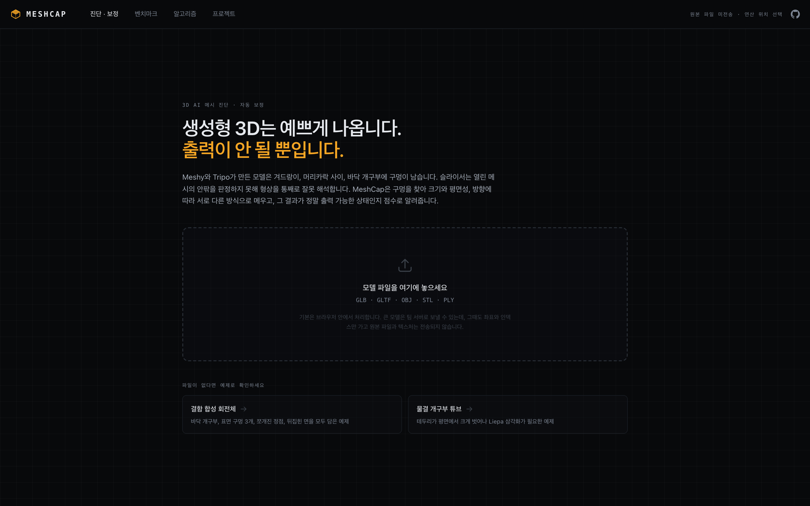
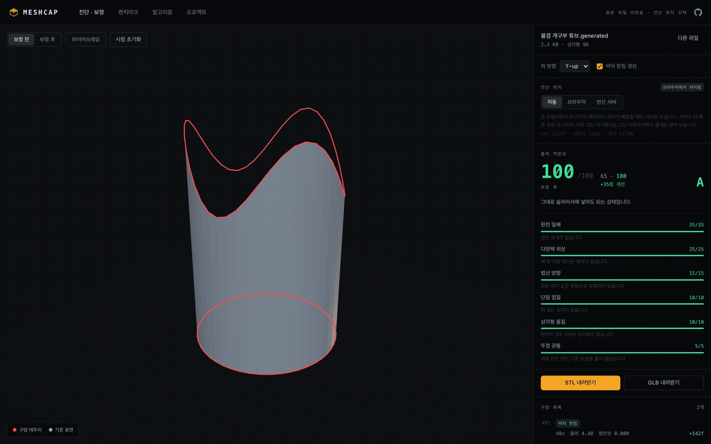
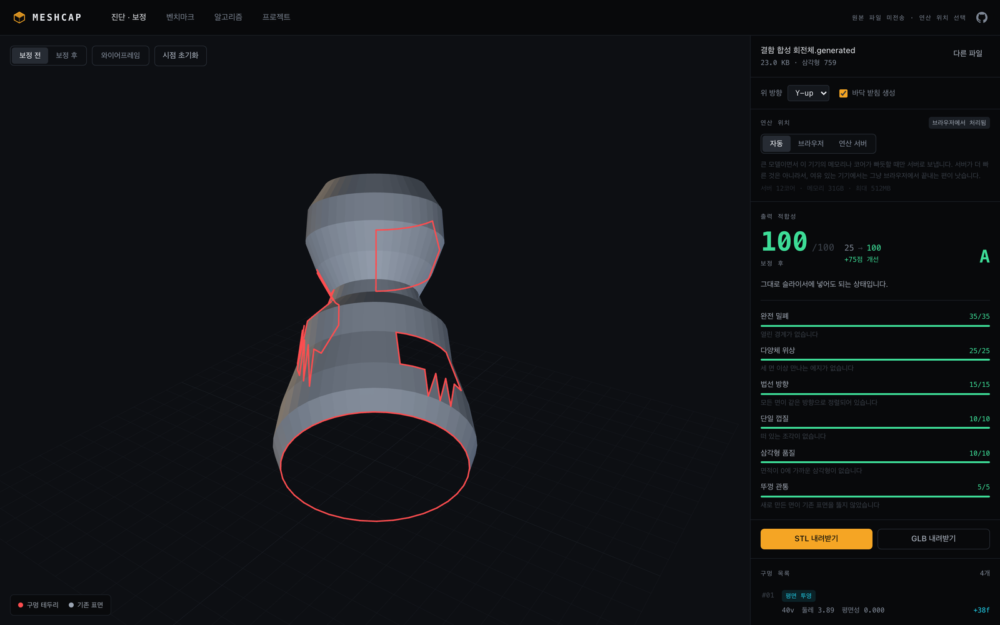
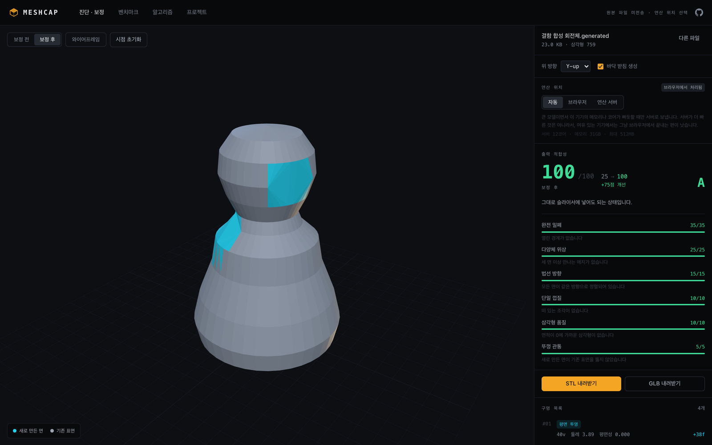
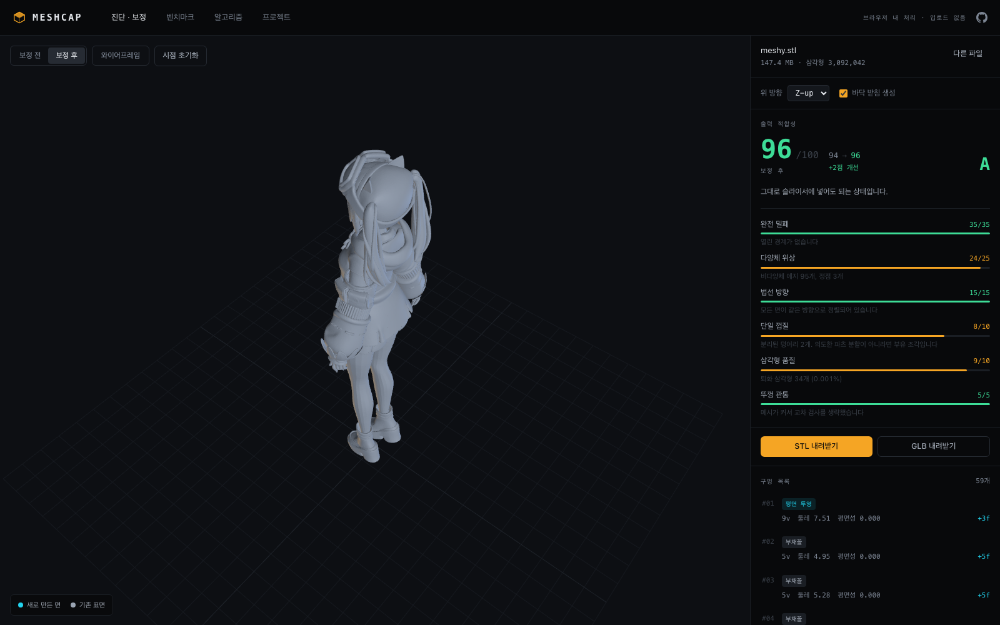
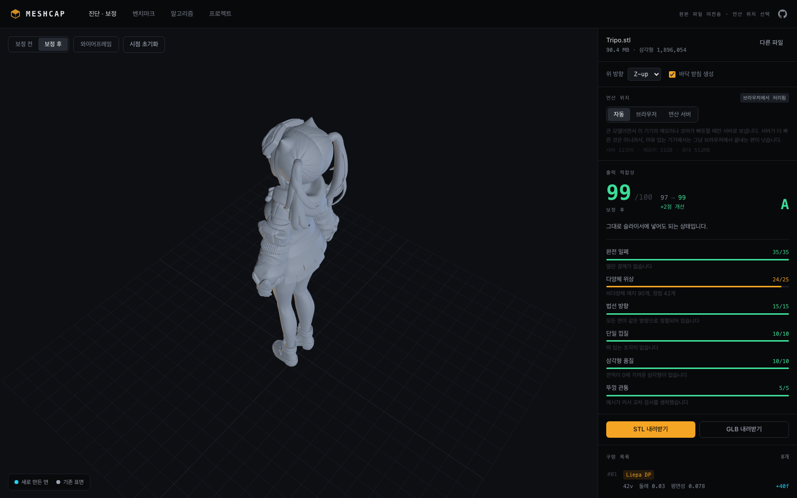
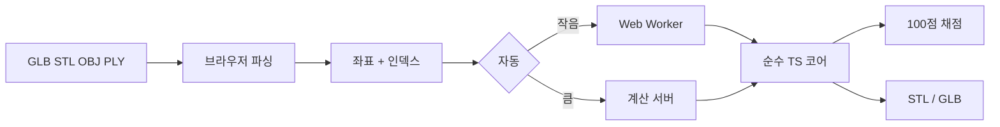
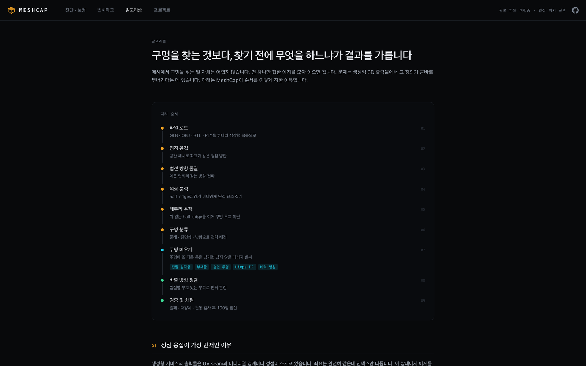
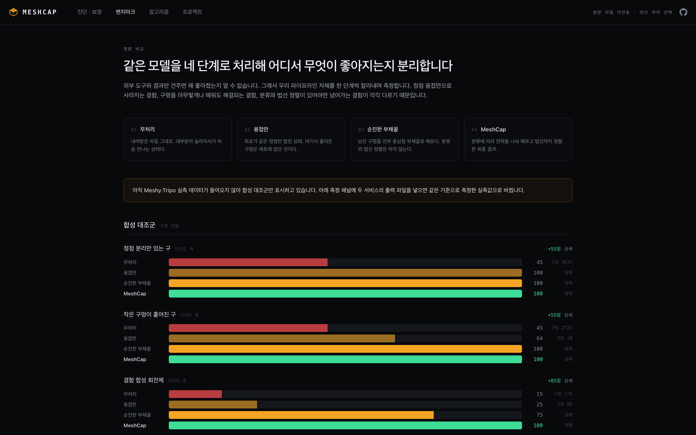

<p align="center">
  
</p>

<h1 align="center">MeshCap</h1>

<p align="center">
  3D AI로 만든 모델의 구멍을 찾아 메운 다음,<br />
  슬라이서에 넣어도 되는지 100점으로 채점하는 브라우저 도구.
</p>

<p align="center">
  <a href="https://meshcap.junnnny.kr"></a>
</p>

<p align="center">
  <a href="https://github.com/JunnnnyWon/meshcap/actions/workflows/ci.yml"></a>
  <a href="LICENSE"></a>
  
  
  
</p>

<p align="center">
  <a href="https://meshcap.junnnny.kr"><b>데모</b></a> ·
  <a href="#실행">실행</a> ·
  <a href="#파이프라인">파이프라인</a> ·
  <a href="#실제-모델">실제 모델</a> ·
  <a href="#한계">한계</a>
</p>

<p align="center">
  
</p>

<br />

미리보기에서는 괜찮은데 안쪽과 바닥이 뚫려 있는 경우가 많다. 3D AI로 만든 캐릭터를 슬라이서에 넣으면 팔 아래, 머리카락 사이, 바닥이 자주 열린다. 슬라이서는 면이 어느 쪽을 보는지로 안팎을 가리기 때문에 뚫린 곳은 속이 비어 버린다.

GLB · STL · OBJ · PLY를 브라우저에 놓으면 구멍을 나눠 메우고 막힘·겹친 모서리·면 방향을 검사한 뒤 STL/GLB를 내려준다. 원본 파일은 서버로 안 올라간다. 기본은 브라우저에서 돌리고 큰 모델만 좌표와 인덱스를 계산 서버로 넘긴다.

<p align="center">
  
</p>

<p align="center"><sub>예제 「물결 테두리 튜브」. 평평하지 않은 테두리를 Liepa 삼각화와 바닥 받침으로 닫음. 65점 → 100점.</sub></p>

## 하는 일

파일을 넣으면 대략 이 순서로 간다.

1. 좌표는 같은데 인덱스만 다른 점을 합친다. UV 이음매를 구멍으로 잘못 잡는 일을 여기서 막는다.
2. 짝이 없는 half-edge로 테두리를 잇는다. 면이 셋 이상 모인 자리에서도 순회가 끊기지 않게.
3. 면의 감는 방향을 맞춘 다음 구멍을 찾는다. 뒤집힌 면을 구멍으로 세지 않으려고.
4. 구멍마다 크기·평평함·방향을 보고 메우는 방법을 고른다.
5. 막힘, 겹친 모서리, 면 방향, 관통을 100점으로 채점한다.
6. STL 또는 GLB로 내보낸다.

<table>
  <tr>
    <td align="center" width="50%">
      
      <br /><sub>보정 전</sub>
    </td>
    <td align="center" width="50%">
      
      <br /><sub>보정 후 · 25 → 100</sub>
    </td>
  </tr>
</table>

## 실제 모델

3D AI에서 받은 캐릭터 STL도 브라우저에서 돌렸다.

<table>
  <tr>
    <th></th>
    <th align="left">3D AI A</th>
    <th align="left">3D AI B</th>
  </tr>
  <tr>
    <td>삼각형</td>
    <td>3,092,042</td>
    <td>1,896,054</td>
  </tr>
  <tr>
    <td>파일</td>
    <td>147 MB</td>
    <td>90 MB</td>
  </tr>
  <tr>
    <td>점수</td>
    <td>94 → <b>96</b></td>
    <td>97 → <b>99</b></td>
  </tr>
  <tr>
    <td>열린 모서리</td>
    <td>120 → <b>0</b></td>
    <td>14 → <b>0</b></td>
  </tr>
  <tr>
    <td>막힘</td>
    <td>막힘</td>
    <td>막힘</td>
  </tr>
  <tr>
    <td>브라우저</td>
    <td>약 7초</td>
    <td>약 4–10초</td>
  </tr>
</table>

<table>
  <tr>
    <td align="center" width="50%">
      
      <br /><sub>3D AI A · 309만 삼각형 · 94 → 96</sub>
    </td>
    <td align="center" width="50%">
      
      <br /><sub>3D AI B · 190만 삼각형 · 97 → 99</sub>
    </td>
  </tr>
</table>

100점이 안 나온 이유도 적어 두었다. 구멍을 메우면 이미 면 셋이 붙어 있던 모서리에 면이 하나 더 붙을 수 있다. 표면을 닫는 일과 모서리를 깨끗하게 만드는 일이 가끔 충돌한다. 그래서 채점에서 둘을 갈라 두었다.

## 파이프라인

코어는 three.js를 안 쓴다. 순수 TypeScript라 웹 워커, Node 벤치, 계산 서버가 같은 코드를 돌린다. 화면에 찍힌 숫자와 서버가 준 숫자가 다를 일이 없다.



| 단계 | 하는 일 |
| --- | --- |
| 01 로드 | 포맷을 가리지 않고 삼각형 목록으로 맞춘다 |
| 02 용접 | 같은 좌표 점을 공간 해시로 합친다. UV 이음매 오탐을 여기서 없앤다 |
| 03 법선 | 이웃 면의 감는 방향을 퍼뜨린다. 뒤집힌 면이 구멍으로 보이기 전에 고친다 |
| 04 위상 | half-edge로 경계, 비다양체, 연결 요소를 센다 |
| 05 테두리 | 짝 없는 half-edge를 이어 닫힌 루프로 만든다 |
| 06 분류 | 둘레, 평면성, 방향으로 전략을 고른다 |
| 07 메움 | 삼각형 / 부채꼴 / 평면+earcut / Liepa DP / 바닥 받침. 틈이 줄어들 때까지 반복 |
| 08 바깥 | 부호 있는 부피로 껍질 바깥을 맞춘다 |
| 09 채점 | 밀폐 35 · 다양체 25 · 법선 15 · 단일 껍질 10 · 퇴화 10 · 뚜껑 관통 5 |

<p align="center">
  
</p>

같은 알고리즘이라도 순서를 바꾸면 결과가 달라진다. 저장소에 그걸 확인하는 테스트가 있다.

용접을 빼면 구멍이 없는 모델에서도 이음매마다 경계가 잡힌다. 대조군 `정점 분리만 있는 구`는 닫힌 모델인데 용접 전 45점, 용접만 하면 100점이다. 메운 구멍은 없다.

법선 정렬을 구멍 찾기보다 뒤로 미루면 뒤집힌 면이 구멍으로 잡힌다. 면이 뒤집히면 에지 세 개의 방향 짝이 깨져서 막힌 자리에도 짝 없는 half-edge가 남는다. `결함 합성 회전체`는 정렬 전 테두리 86개, 실제 구멍은 4개다.

<details>
<summary><b>테두리를 어떻게 찾나</b></summary>

<br />

「한 면만 접한 에지」로 테두리를 정하면 실제 모델에서 자주 끊긴다. 면 셋이 한 에지를 공유하면 그 자리는 경계가 아닌데, 따라가던 순회가 거기서 멈춘다. 위 3D AI 캐릭터는 비다양체 에지 93개 때문에 경계 정점 178개 중 117개의 차수가 어긋났고, 테두리가 사슬로만 잡혀 하나도 못 메웠다.

대신 **반대 방향 짝을 못 찾고 남은 half-edge**를 모은다. 삼각형 하나가 각 정점에 진입과 진출을 하나씩 주니 처음부터 차수가 맞고 짝을 지우면 양쪽이 같이 줄어 균형이 유지된다. 균형 잡힌 유향 그래프는 순환으로 분해되니 순회가 끊기지 않는다. 같은 모델의 테두리 59개가 모두 닫혔다.

</details>

### 구멍마다 다른 뚜껑

| 조건 | 전략 | 이유 |
| --- | --- | --- |
| 테두리가 안 닫힘 | 건너뜀 | 구멍 범위가 확정이 안 됨 |
| 정점 3개 | 삼각형 하나 | 그걸로 닫힘 |
| 아래를 향한 큰 구멍 | 바닥 받침 | 베드에 평평하게 닿아야 첫 층이 안 뜸 |
| 정점 8개 이하 | 부채꼴 | 중심이 표면에서 멀지 않음 |
| 평면성 0.06 미만 | 평면 투영 + earcut | 오목한 다각형도 채울 수 있음 |
| 정점 250개 이하 | Liepa 최소 가중 삼각화 | 주변 곡률을 따라감 |
| 그 외 | 평면 투영 | O(n³)이라 응답을 우선함 |

## 벤치마크

같은 모델을 원본 → 용접만 → 그냥 부채꼴 → MeshCap 순으로 돌려 점수가 어디서 오르는지 본다. 용접만으로 100점이 되는 경우도 있고, 분류와 법선 정렬이 있어야 100점이 되는 경우도 있다.

<p align="center">
  
</p>

```bash
npm test           # 코어 · 프로토콜
npm run bench      # 합성 대조군 → src/bench/results.json
```

## 실행

```bash
git clone https://github.com/JunnnnyWon/meshcap.git
cd meshcap
npm install
npm run dev        # http://localhost:5180
```

파일을 놓거나, 첫 화면 예제 둘로 바로 보면 된다.

| 명령 | 역할 |
| --- | --- |
| `npm test` | Vitest. 용접, 테두리, 순서 실험 |
| `npm run typecheck` | `tsc --noEmit` |
| `npm run bench` | 합성 대조군 측정 |
| `npm run api` | 계산 서버. 개발 서버가 `/api`로 프록시 |
| `npm run build` | 타입 검사 후 Vite 빌드 |

`main`에 푸시하면 GitHub Actions가 테스트와 Docker 이미지 빌드를 확인한다. 배포는 [docs/DEPLOY.md](docs/DEPLOY.md).

## 어디서 계산하나

기본은 브라우저다. 원본 파일은 나가지 않는다. 파일을 열고 텍스처를 버리고 좌표만 남기는 일도 브라우저에서 한다.

좌표와 인덱스만 받아 같은 파이프라인을 돌리는 계산 서버도 같이 올려 두었다. 코어를 three.js에서 떼 둔 덕에 서버는 같은 파일을 그대로 불러 쓴다. `bench/api-check.ts`가 좌표 단위까지 맞춰 본다.

서버가 더 빠르지는 않다. 파이프라인이 한 스레드라 코어 수가 도움이 안 되고, 재보니 서버가 최신 노트북보다 느렸다. 삼백만 삼각형이면 좌표만 140MB를 보내야 한다.

| 3D AI B (190만 삼각형) | 소요 |
| --- | --- |
| 브라우저 | 10.3초 |
| 계산 서버 (전송 포함) | 31.5초 |

자동 모드는 속도가 아니라 **이 기기가 버티느냐**로 서버를 고른다. 50만 이하 항상 브라우저, 400만 초과 항상 서버, 그 사이는 메모리와 코어 수를 본다. 화면에서 브라우저로 고정할 수 있고, 어디서 돌렸는지는 매번 보여 준다.

공개 데모는 [meshcap.junnnny.kr](https://meshcap.junnnny.kr). Cloudflare 무료 플랜 본문 제한 때문에 좌표가 95MB를 넘으면 공개 경로에서는 브라우저로 접는다.

## 구조

```
src/
├─ core/            알고리즘. three.js 없는 순수 TypeScript
│  ├─ weld.ts       공간 해시 정점 병합
│  ├─ halfEdge.ts   에지 인접과 위상 결함
│  ├─ boundary.ts   경계 half-edge를 이어 루프 복원
│  ├─ classify.ts   구멍 특징과 전략
│  ├─ cap/          fan · planar · liepa · flatBase
│  ├─ normals.ts    감는 방향 전파, 바깥 정렬
│  ├─ validate.ts   밀폐·다양체·관통
│  ├─ score.ts      출력 적합성 100점
│  └─ pipeline.ts   전체 순서
├─ io/              로더, STL·GLB 익스포터
├─ viewer/          three.js 뷰어
├─ worker/          웹 워커
├─ net/             계산 서버 바이너리 프로토콜
├─ bench/           벤치 스키마와 측정
└─ pages/           도구 · 벤치마크 · 알고리즘 · 프로젝트

server/index.ts     계산 서버. src/core를 그대로 불러 씀
```

## 한계

- 테두리가 여러 갈래로 갈라지면 순회는 닫히지만 나뉘는 모양이 유일하지는 않다.
- 면 셋이 공유하던 에지를 메우면 그 자리의 비다양체가 더 심해질 수 있다. 닫는 일과 다양체로 만드는 일을 맞바꾼 것이고, 채점에서 둘을 갈라 둔 이유다.
- 겹친 이중 표면은 뚜껑도 두 겹이 생긴다. 점수에는 넣지만 자동으로 지우지는 않는다.
- 바닥 받침은 투영된 테두리가 스스로 겹치면 옆벽이 교차할 수 있다.
- 벽 두께는 안 본다. 밀폐여도 벽이 노즐보다 얇으면 출력이 안 된다.
- 삼각형 300만 개면 대략 7초, 메모리 1.4GB. 저사양에서는 모델을 줄인 다음 쓰는 편이 낫다.

## 팀

2026 청강 AI 크리에이티브 부스트 공모전 · 청강문화산업대학교 게임콘텐츠스쿨

| 이름 | 역할 |
| --- | --- |
| 조원준 | 총괄 · 3D 생성 파이프라인 |
| 박정훈 | 구멍 메우기 · 메시 정리 |
| 배윤서 | 3D 프린팅 테스트, 기록 |

## 라이선스

[MIT](LICENSE) · Copyright © 2026 조원준, 박정훈, 배윤서
